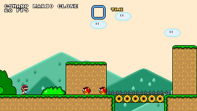

# MonoMario
## What is this?
MonoMario is an source proof-of-concept Super Mario World-type engine made in C# using the MonoGame framework.
## Compilation
Install MonoGame (I used MonoGame 3.8), a full guide can be found here: https://docs.monogame.net/articles/getting_started/1_setting_up_your_development_environment_windows.html
From there, just run the game from inside of the solution.
## Early Gameplay GIF
